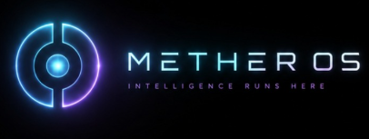

<div align="center">



<br/>
<br/>

```
███╗   ███╗███████╗████████╗██╗  ██╗███████╗██████╗      ██████╗ ███████╗
████╗ ████║██╔════╝╚══██╔══╝██║  ██║██╔════╝██╔══██╗    ██╔═══██╗██╔════╝
██╔████╔██║█████╗     ██║   ███████║█████╗  ██████╔╝    ██║   ██║███████╗
██║╚██╔╝██║██╔══╝     ██║   ██╔══██║██╔══╝  ██╔══██╗    ██║   ██║╚════██║
██║ ╚═╝ ██║███████╗   ██║   ██║  ██║███████╗██║  ██║    ╚██████╔╝███████║
╚═╝     ╚═╝╚══════╝   ╚═╝   ╚═╝  ╚═╝╚══════╝╚═╝  ╚═╝     ╚═════╝ ╚══════╝
```

**`:: TACTICAL INTELLIGENCE INTERFACE // PERSONAL AI OPERATING SYSTEM`**

<br/>

[](https://github.com/mether-os/mether-core/blob/main/LICENSE)
[](https://github.com/mether-os/mether-core/actions)
[](https://github.com/mether-os/mether-core/actions)
[](https://github.com/mether-os/mether-core/stargazers)
[](https://github.com/mether-os/mether-core/releases)
[](https://github.com/mether-os/mether-core)

<br/>

> *"The AI is brilliant. The infrastructure around it is dumb."*
> 
> METHER OS fixes that.

<br/>


<br/>

</div>

---

## `:: WHAT IS THIS`

Most AI tools are glorified chatbots. You ask, they answer, you forget. Every session starts from scratch. Every workflow is manual. They can't **do** things — only describe them.

**METHER OS is different.**

It's a self-hosted personal AI system that:
- **Remembers you** — your projects, contacts, priorities, communication style
- **Has hands** — controls your PC, sends WhatsApp, reads Gmail, manages Calendar
- **Has a voice** — wake word detection, real-time STT, natural TTS
- **Runs locally** — zero cloud dependency, zero subscriptions, zero data harvesting
- **Costs nothing** — routes through free LLM APIs (NVIDIA NIM, OpenRouter)

Built with a tactical sci-fi HUD that makes you feel like Tony Stark. Because why not.

---

## `:: CAPABILITIES`

<table>
<tr>
<td width="50%">

**🎙️ Voice Pipeline**
```
"Hey Mether" → wake word detected
→ Whisper STT (Hinglish support)
→ Agent processes
→ Piper TTS responds
→ Back to standby
```

**💬 WhatsApp Automation**
```
→ Read all chats + groups
→ Send on your behalf
→ Auto-handle mode (AI replies)
→ New message ping + confirmation
→ Human-style reply formatting
```

**🖥️ System Control**
```
→ Open any application
→ Run shell commands (live output)
→ Read/search/write files
→ Manage processes
→ Clipboard + Screenshots
```

</td>
<td width="50%">

**📧 Google Suite**
```
→ Gmail: search, read, send, reply
→ Calendar: view, create, find slots
→ Drive: search, read, upload
→ OAuth 2.0 persistent auth
```

**🧠 Persistent Memory**
```
→ CLAUDE.md: your operating manual
→ SQLite: session context
→ ChromaDB: semantic long-term RAG
→ Knows your style, projects, people
```

**⚡ Tactical HUD**
```
→ React 19 + TypeScript
→ Framer Motion animations
→ Real-time WebSocket updates
→ Voice orb with state visualization
→ Live agent log + radar
```

</td>
</tr>
</table>

---

## `:: ARCHITECTURE`

```
┌─────────────────────────────────────────────────────────────────────┐
│  INPUT LAYER                                                         │
│  Voice "Hey Mether" │ Web Dashboard │ WhatsApp │ Telegram           │
└──────────────────────────────┬──────────────────────────────────────┘
                               │
┌──────────────────────────────▼──────────────────────────────────────┐
│  BRAIN — FastAPI + asyncio + EventBus                                │
│  Agent Loop → LLM (free-claude-code proxy) → Tool Selection         │
│  Memory: CLAUDE.md + SQLite (session) + ChromaDB (long-term RAG)   │
└──────────────────────────────┬──────────────────────────────────────┘
                               │
┌──────────────────────────────▼──────────────────────────────────────┐
│  TOOLS — BaseTool architecture, security levels 0/1/2               │
│  Gmail │ Calendar │ Drive │ WhatsApp │ AppLaunch │ Terminal │ Files  │
└──────────────────────────────┬──────────────────────────────────────┘
                               │
┌──────────────────────────────▼──────────────────────────────────────┐
│  OUTPUT LAYER                                                         │
│  Piper TTS (voice) │ HUD Dashboard │ WhatsApp replies │ Logs        │
└──────────────────────────────┬──────────────────────────────────────┘
                               │
┌──────────────────────────────▼──────────────────────────────────────┐
│  INFRA                                                                │
│  GitHub Actions CI/CD │ Windows + Linux │ Docker │ free-claude-code │
└─────────────────────────────────────────────────────────────────────┘
```

**Services at runtime:**

| Service | Port | Purpose |
|---------|:----:|---------|
| `Frontend` | `5173` | React HUD dashboard |
| `Backend` | `8000` | FastAPI agent + WebSocket |
| `LLM Proxy` | `8082` | Routes to NVIDIA NIM / OpenRouter |
| `WhatsApp` | `3001` | whatsapp-web.js bridge |
| `Voice` | `—` | Wake word + STT + TTS sidecar |

---

## `:: QUICK START`

### Prerequisites

```
Python 3.11+    Node.js 18+    Git
```

### Install

```bash
git clone https://github.com/mether-os/mether-core.git
cd mether-core

# Windows
infra\install.bat

# Linux
bash infra/install.sh
```

### Get a free LLM key

METHER routes through free APIs. Get one:

```
NVIDIA NIM (recommended):   build.nvidia.com/settings/api-keys
OpenRouter (alternative):   openrouter.ai/keys
```

### Configure

```bash
cp backend/.env.example backend/.env
```

Open `backend/.env` and add your key:

```env
NVIDIA_NIM_API_KEY=nvapi-your-key-here
MODEL=nvidia_nim/z-ai/glm4.7
```

### Run

```bash
# Windows
infra\start.bat

# Linux
bash infra/start.sh
```

Dashboard opens at **http://localhost:5173**

### Personalize (important)

Create `~/.mether/CLAUDE.md` — this is your operating manual. METHER reads this at every session start. Fill it with:

```markdown
## Identity
Name, location, what you do

## Current Focus
Your top 3 priorities right now

## People
Contacts who matter

## Tools
What apps run your life

## Voice
How you want METHER to talk to you

## Hard Rules
Things to never do
```

The more you fill this out, the smarter METHER gets about you.

---

## `:: CONFIGURATION`

| File | Purpose |
|------|---------|
| `backend/.env` | API keys, ports, model selection |
| `~/.mether/CLAUDE.md` | Your personal context file |
| `whatsapp/.env` | WhatsApp bridge settings |
| `voice/.env` | STT model, TTS engine, wake word |

### Voice setup (extra step)

Piper TTS requires downloading a voice model:

```bash
# Download piper binary
# Windows: github.com/rhasspy/piper/releases → piper_windows_amd64.zip
# Place piper.exe in: voice/bin/piper.exe

# Download voice model
# https://huggingface.co/rhasspy/piper-voices
# Recommended: en_US-lessac-medium → voice/models/
```

### Google setup (optional)

```bash
# 1. Create project at console.cloud.google.com
# 2. Enable: Gmail API, Calendar API, Drive API
# 3. Create OAuth 2.0 Desktop credentials
# 4. Download → save as ~/.mether/google_credentials.json
# 5. Visit http://localhost:8000/google/auth to authenticate
```

---

## `:: TOOL REFERENCE`

| Tool | Actions | Security |
|------|---------|:--------:|
| `gmail` | search, read, send, reply, mark_read | READ/WRITE |
| `calendar` | today, week, upcoming, create, find_slot | READ/WRITE |
| `drive` | search, list, read, upload | READ/WRITE |
| `whatsapp` | send, chats, messages, handle, resolve | WRITE |
| `app_launch` | open any app by name | WRITE |
| `code_run` | execute shell commands, stream output live | WRITE |
| `filesystem` | list, read, search, write files | READ/WRITE |
| `process` | list, info, kill processes | READ/**DANGEROUS** |
| `clipboard` | read, write | READ/WRITE |
| `screenshot` | capture screen | READ |
| `system_info` | CPU, RAM, uptime | READ |

> **DANGEROUS** actions require explicit confirmation via the dashboard confirm dialog before execution.

---

## `:: ADD YOUR OWN TOOLS`

METHER is designed to be extended. Adding a tool takes ~20 lines:

```python
# backend/src/mether/tools/my_tool.py

from mether.tools.base import BaseTool, ToolResult, SecurityLevel

class SpotifyTool(BaseTool):
    name = "spotify"
    description = "Control Spotify: play, pause, skip, search tracks"
    security_level = SecurityLevel.WRITE

    async def execute(self, action: str, **kwargs) -> ToolResult:
        if action == "play":
            # your logic
            return ToolResult(success=True, data={"playing": kwargs["track"]})
        
        return ToolResult(success=False, error=f"Unknown action: {action}")
```

Register in `backend/src/mether/main.py`:

```python
registry.register(SpotifyTool())
```

That's it. METHER's agent automatically discovers and uses the tool.

**Ideas for community tools:**
- Notion read/write
- Linear / Jira issue management  
- Spotify / YouTube control
- Home Assistant smart home
- Slack / Discord messaging
- GitHub PR reviews
- Obsidian notes

---

## `:: DEPLOYMENT`

### Self-hosted (recommended)

Everything runs on your machine. Use the startup scripts:

```bash
infra\start.bat        # Start all services
infra\stop.bat         # Stop all services
infra\autostart\register_autostart.bat   # Auto-start on Windows boot
```

### Docker

```bash
docker-compose up -d
```

### Cloud (Render + Vercel)

See [docs/DEPLOYMENT.md](docs/DEPLOYMENT.md) for the full cloud deployment guide.

> ⚠️ **Note:** WhatsApp and Voice sidecars require local machine access (mic, browser session). Only backend + frontend can be cloud-deployed. Run WhatsApp + Voice locally and point them at your cloud backend.

---

## `:: TECH STACK`

**Backend**

```
Python 3.11    FastAPI    asyncio    Pydantic v2
structlog      httpx      SQLite     ChromaDB
psutil         pyperclip  mss
```

**Frontend**

```
React 19       TypeScript    Vite       Tailwind CSS
Framer Motion  Zustand       Lucide     WebSocket
```

**Voice**

```
faster-whisper    openWakeWord    Piper TTS    sounddevice
```

**WhatsApp**

```
whatsapp-web.js    puppeteer    Express    Node.js 18+
```

**LLM Routing**

```
free-claude-code proxy → NVIDIA NIM → glm4.7 / kimi-k2.5
                       → OpenRouter → free tier models
```

---

## `:: PROJECT STATUS`

| Module | Status |
|--------|:------:|
| Frontend HUD | ✅ Stable |
| Backend Agent | ✅ Stable |
| WebSocket | ✅ Stable |
| LLM Integration | ✅ Stable |
| WhatsApp Bridge | ✅ Stable |
| Voice Pipeline | ✅ Beta |
| Google Suite | ✅ Stable |
| System Tools | ✅ Stable |
| CI/CD | ✅ Active |
| Docker | ✅ Ready |
| Iron Man Holographic Orb | 🔄 v2 roadmap |

---

## `:: CONTRIBUTING`

Read [CONTRIBUTING.md](CONTRIBUTING.md) first.

**What we need most:**

```
→ New tool integrations (Notion, Linear, Slack, Spotify, Home Assistant)
→ Hindi / regional language TTS voice models
→ Better wake word accuracy
→ Mobile bridge (Android / iOS)
→ Windows installer (.exe)
→ Linux packaging (.deb / .AppImage)
→ Performance optimization (voice latency)
```

**Commit convention:**

```bash
feat(scope):     new feature
fix(scope):      bug fix
docs(scope):     documentation update
ci(scope):       CI/CD changes
refactor(scope): code refactor
test(scope):     test additions
```

---

## `:: SECURITY`

METHER runs locally. Key points:

- API keys live in `.env` files — never committed (enforced by `.gitignore`)
- WhatsApp tool has full send access — review auto-handle settings carefully
- Terminal tool executes real shell commands — dangerous actions require confirm
- Google OAuth tokens in `~/.mether/` — keep this directory private
- Backend has no auth by default — **do not expose port 8000 to the internet**

Report vulnerabilities privately — see [SECURITY.md](SECURITY.md).

---

## `:: LICENSE`

MIT — see [LICENSE](LICENSE)

Free to use, modify, and distribute. Attribution appreciated but not required.

---

<div align="center">

```
[ METHER OS // TACTICAL INTERFACE // v1.0.0 ]
[ BUILT BY MAYANK SHARMA AND CONTRIBUTORS  ]
[ GITHUB.COM/METHER-OS/METHER-CORE         ]
```

<br/>

**[⭐ Star this repo](https://github.com/mether-os/mether-core)** if METHER OS is useful to you.

Stars help others find this project.

<br/>

*Built in 30 days. Runs forever.*

</div>
