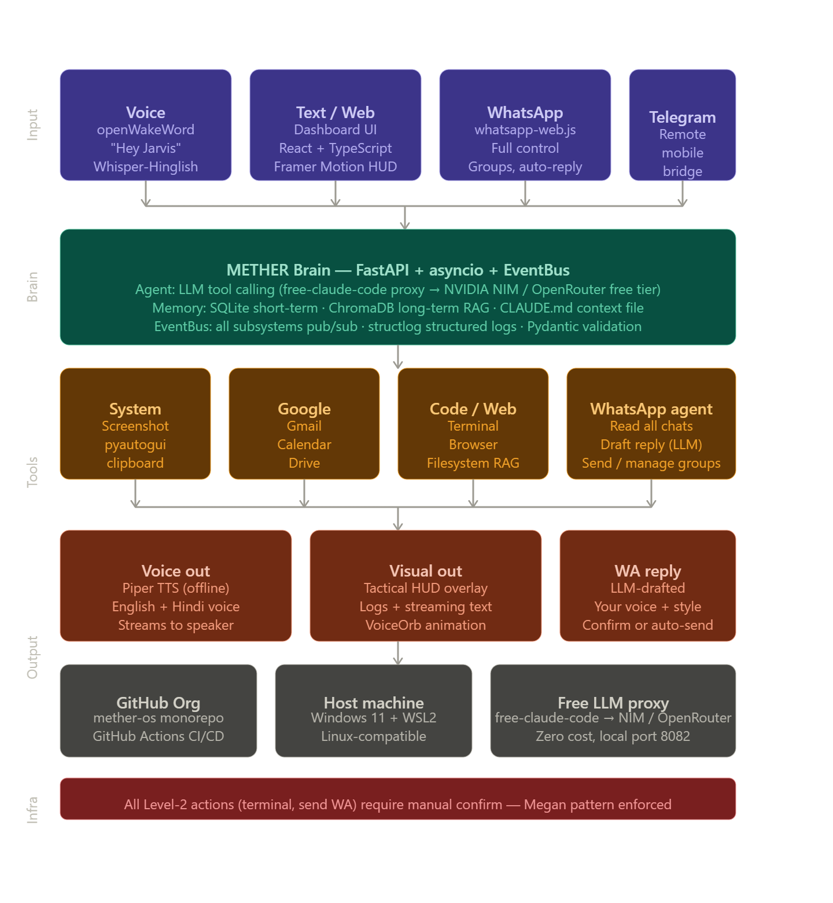
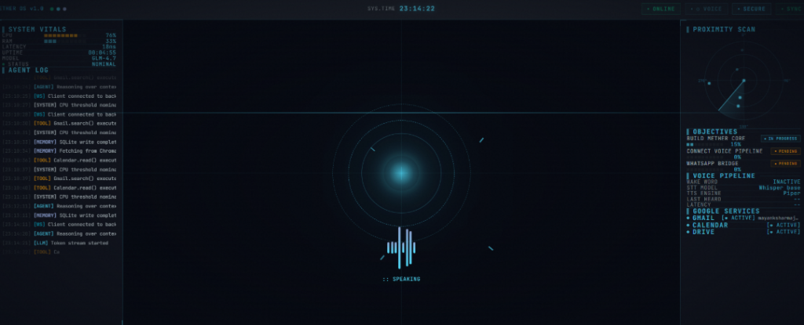

# METHER OS: System Architecture

**Version:** 1.0  
**Date:** May 16, 2026  
**Status:** Foundation Phase (Day 1)

---

## Executive Summary



METHER OS is a **personal AI operating system** — a five-layer stack combining voice input, LLM reasoning, tool execution, multi-modal output, and cloud-free infrastructure.

**Core principle:** Jarvis-level autonomy without the cloud. Every computation happens locally or through free APIs. Full WhatsApp automation. Hinglish voice support. Tactical HUD dashboard.

---

## Architecture Layers

```
┌─────────────────────────────────────────────────────────────┐
│ LAYER 1: INPUT (Voice / Web / WhatsApp / Telegram)          │
├─────────────────────────────────────────────────────────────┤
│ LAYER 2: BRAIN (FastAPI + asyncio + EventBus + LLM)         │
├─────────────────────────────────────────────────────────────┤
│ LAYER 3: TOOLS (System / Google / Code / WhatsApp / Web)    │
├─────────────────────────────────────────────────────────────┤
│ LAYER 4: OUTPUT (Voice / Visual / WhatsApp / Telegram)      │
├─────────────────────────────────────────────────────────────┤
│ LAYER 5: INFRA (GitHub / Windows+WSL / LLM Proxy / CI/CD)  │
└─────────────────────────────────────────────────────────────┘
```

### Layer 1: Input — Four Control Interfaces

| Interface | Protocol | Use Case | Status |
|-----------|----------|----------|--------|
| **Voice** | openWakeWord + Whisper-Hinglish | Hands-free "Hey Jarvis" | v1 |
| **Web Dashboard** | WebSocket (React UI) | Type commands, see HUD | v1 |
| **WhatsApp** | whatsapp-web.js (full control) | Read/send/manage groups | v1 |
| **Telegram** | Bot API | Mobile remote access | v2 |

**Data flow to brain:** All inputs normalize to a single `UserMessage` object:
```python
@dataclass
class UserMessage:
    text: str
    source: Literal["voice", "web", "whatsapp", "telegram"]
    context: Dict[str, Any]  # source-specific metadata
    timestamp: datetime
```

### Layer 2: Brain — The Agent Loop

**Framework:** FastAPI + Python asyncio + Pydantic validation

**Core components:**

1. **Agent Orchestrator** (`agent/agent.py`)
   - Runs the main reasoning loop
   - Receives `UserMessage` → processes with LLM
   - Uses Claude (via free-claude-code proxy) for tool calling
   - Returns `AgentResponse` with actions to execute

2. **Memory System**
   - **CLAUDE.md** — Static context file (who you are, style, rules)
   - **SQLite** — Short-term memory (session logs, recent interactions)
   - **ChromaDB** — Long-term semantic search (RAG over your files/emails)

3. **EventBus** (Publisher/Subscriber)
   - All subsystems emit events: `VoiceDetected`, `ToolExecuted`, `ResponseGenerated`
   - UI subscribes to events for real-time updates
   - Decouples brain from output layers

4. **LLM Integration** (free-claude-code proxy)
   - **Model:** Claude (Sonnet 4.6 via NVIDIA NIM or OpenRouter free tier)
   - **Tool calling:** Agent tells Claude which tools it can use
   - **Token budget:** ~4k context per request
   - **Latency:** 0.8–1.5s for first token (acceptable for a personal OS)

**Reasoning flow:**
```
UserMessage → Agent.process()
  ↓
Load CLAUDE.md + recent memory
  ↓
Call LLM with available tools
  ↓
LLM decides: "I need to call tool X with params Y"
  ↓
Execute tool, get result
  ↓
Feed result back to LLM
  ↓
LLM generates final response
  ↓
Emit AgentResponse event
```

### Layer 3: Tools — The Execution Layer

Each tool is a **Python class** inheriting from `BaseTool`:

```python
class BaseTool(ABC):
    name: str
    description: str
    security_level: Literal[0, 1, 2]  # 0=read-only, 1=write, 2=dangerous
    
    async def execute(self, **kwargs) -> ToolResult:
        pass
```

**Implemented tools:**

| Tool | Category | Examples | Security |
|------|----------|----------|----------|
| **System** | Desktop automation | Screenshot, clipboard, app launch, hotkeys | Level 1 |
| **Gmail** | Email | Search inbox, draft reply, send | Level 1 |
| **Calendar** | Schedule | Read events, create event, find slots | Level 1 |
| **Drive** | Files | Search, read, upload to workspace | Level 1 |
| **Terminal** | Execution | Run shell commands, cd, ls | Level 2 |
| **Browser** | Web | Navigate, click, extract text | Level 1 |
| **Filesystem RAG** | Search | Semantic search over local codebase | Level 0 |
| **WhatsApp** | Messaging | Read chats, draft reply, send, manage groups | Level 2 |

**Security model:**
- Level 0 (read-only): Execute immediately
- Level 1 (safe write): Execute with confirmation if needed
- Level 2 (dangerous): **Always require explicit user confirmation** via UI ("Megan pattern")

**Tool result format:**
```python
@dataclass
class ToolResult:
    success: bool
    data: Any
    error: Optional[str]
    timestamp: datetime
```

### Layer 4: Output — Multi-Modal Responses

| Output | Target | Format | Async |
|--------|--------|--------|-------|
| **Voice** | Speaker | Piper TTS (English + Hindi) | Streaming |
| **Visual** | Web dashboard | Text + HUD animations | Real-time |
| **WhatsApp** | Chat groups | Text + media | Draft → confirm |
| **Logs** | Terminal feed | Timestamped entries | Streaming |

**Voice synthesis:**
- **Engine:** Piper TTS (offline, CPU-based, ~150ms per sentence)
- **Languages:** English + Hindi (Hinglish mixed)
- **Quality:** Good (not perfect, but natural enough)
- **Fallback:** Text-to-speech on failure

**Visual dashboard:**
- Real-time WebSocket updates
- Tactical HUD aesthetic (cyan glows, grids, data-dense)
- Voice orb animation (idle → listening → speaking)
- Scrolling logs of agent actions

### Layer 5: Infrastructure — Deployment & Ops

**Hosting:**
- **Always-on machine:** Your Windows 11 laptop + WSL2
- **Port:** FastAPI backend runs on `localhost:8000`
- **Proxy:** free-claude-code on `localhost:8082` (routes to NVIDIA NIM / OpenRouter)

**Version control & CI/CD:**
- **Monorepo:** `github.com/mether-os/mether-core`
- **GitHub Actions:** Automated tests on every commit
  - Backend: pytest, ruff linting, mypy type checking
  - Frontend: ESLint, Prettier, vitest
- **Deployment:** Manual (copy files, restart service)

**LLM routing:**
```
Claude Code request
    ↓
free-claude-code proxy (port 8082)
    ↓
Route to: NVIDIA NIM (free tier) or OpenRouter (free models)
    ↓
Response streamed back
```

---

## Data Flow Diagram

```
┌──────────────┐
│ VOICE INPUT  │ ── "Hey Jarvis, what's my calendar?"
│ openWakeWord │
└──────┬───────┘
       ↓
┌──────────────────┐
│ STT: Whisper     │ ── Transcribe to: "what's my calendar?"
│ Hinglish model   │
└──────┬───────────┘
       ↓
┌──────────────────────────────────┐
│ AGENT LOOP (Layer 2)             │
│ 1. Load CLAUDE.md context        │
│ 2. Call LLM with tools list      │
│ 3. LLM: "I need Google Calendar" │
│ 4. Execute tool, get events      │
│ 5. Format response               │
└──────┬───────────────────────────┘
       ↓
┌──────────────────────────────────┐
│ OUTPUT (Layer 4)                 │
│ - Speak: "Your next event is..." │
│ - Show: Visual HUD with events   │
│ - Log: [12:34:56] Calendar read  │
└──────────────────────────────────┘
```

---

## Memory Architecture

### Tier 1: Static Context (CLAUDE.md)
File path: `~/.mether/CLAUDE.md`

```markdown
# YOUR OPERATING MANUAL

## Identity
- Name: Miku
- Location: Jaipur, Rajasthan
- Work: B.Tech Computer Science, Kalvium x JECRC
- Interests: Builders, hackathons, open source

## Current Focus (Top 3 priorities)
1. Build METHER OS (personal AI)
2. Contribute to open source (sktime/skpro)
3. LeetCode DSA consistency

## Voice & Style
- Casual, technical
- Short sentences
- Ask before executing dangerous actions
- Prefer Hindi + English mix

## Hard Rules
- Never delete files without confirmation
- Never send email without approval
- Never access private files
```

**Why it matters:** Every LLM prompt includes this. The agent "knows you" without needing to learn.

### Tier 2: Session Memory (SQLite)
Database: `~/.mether/session.db`

**Tables:**
- `interactions` — Each user message + agent response + timestamp
- `tool_executions` — Tool runs, results, errors
- `user_preferences` — Learned settings over time

**Cleared:** Daily (24-hour rolling window)

**Purpose:** Context for current session. "What did I ask you 10 minutes ago?"

### Tier 3: Long-term Memory (ChromaDB)
Database: `~/.mether/vectors.db`

**Indexed:**
- Your notes/documents
- Email threads
- Code files
- Project docs

**Query:** Semantic search. "Find all notes about AI projects."

**Refresh:** Weekly (batch embeddings)

---

## EventBus Design

**Pattern:** Pub/Sub using Python's `asyncio` + simple in-process queue

```python
# Subscribe to events
bus.subscribe('voice_detected', handler=on_voice)
bus.subscribe('tool_executed', handler=on_tool_done)

# Emit events
bus.emit('voice_detected', UserMessage(...))
bus.emit('tool_executed', ToolResult(...))
```

**Subscribers (Layer 4):**
- WebSocket → sends to frontend
- TTS engine → speaks the response
- Logger → writes to file
- WhatsApp tool → sends message

**Why:** Decouples. Agent doesn't know (or care) that the frontend is listening.

---

## Security & Safety

### Principle: User In The Loop (Megan Pattern)

Level 2 (dangerous) tools require explicit UI confirmation:

1. Agent says: "I will send WhatsApp message to @friends: 'Let's code'"
2. UI shows: **CONFIRM SEND?** [YES] [NO]
3. User clicks YES
4. Tool executes
5. Response sent back

**Never auto-execute:** `terminal`, `send_whatsapp`, `delete_file`

### Input Validation (Pydantic)

Every tool input is validated by a Pydantic model:
```python
class SendWhatsAppInput(BaseModel):
    chat_id: str
    message: str
    
    @field_validator('message')
    def message_length(cls, v):
        if len(v) > 4096:
            raise ValueError('Message too long')
        return v
```

---

## Deployment Checklist

- [ ] Clone monorepo
- [ ] Install Python 3.11 + Node.js 18+
- [ ] Backend: `pip install -r requirements.txt`
- [ ] Frontend: `npm install`
- [ ] Copy `tailwind.config.ts` to frontend
- [ ] Start free-claude-code proxy: `fcc-init` + config
- [ ] Start backend: `uvicorn mether.main:app`
- [ ] Start frontend: `npm run dev`
- [ ] Open http://localhost:5173 (Vite dev server)
- [ ] Say "Hey Jarvis" into your mic

---

## Phase Roadmap

| Phase | Dates | Goal | Status |
|-------|-------|------|--------|
| **0: Foundation** | Days 1–3 | Scaffold, design system, docs | ← NOW |
| **1: Core Brain** | Days 4–7 | Agent loop, LLM tool calling | Next |
| **2: Voice** | Days 8–10 | STT, TTS, wake word | Week 2 |
| **3: Dashboard** | Days 11–14 | Web UI, HUD, animations | Week 2–3 |
| **4: Tools** | Days 15–20 | System, Google, terminal, code | Week 3 |
| **5: WhatsApp** | Days 21–25 | Full control, auto-reply | Week 4 |
| **6: Testing** | Days 26–28 | Unit, integration, security | Week 4 |
| **7: Deploy** | Days 29–30 | EXE, CI/CD, runbook | Week 5 |

---

## File Structure

```
mether-core/
├── backend/
│   ├── pyproject.toml
│   ├── src/mether/
│   │   ├── __init__.py
│   │   ├── main.py              # FastAPI app + startup
│   │   ├── config.py            # Pydantic settings
│   │   ├── agent/
│   │   │   ├── agent.py         # Main loop
│   │   │   └── llm_client.py    # LLM integration
│   │   ├── tools/
│   │   │   ├── base.py          # BaseTool class
│   │   │   ├── system.py        # System tool
│   │   │   ├── google.py        # Gmail, Calendar, Drive
│   │   │   ├── whatsapp.py      # WhatsApp
│   │   │   └── ...
│   │   ├── memory/
│   │   │   ├── claude_md.py
│   │   │   ├── sqlite.py
│   │   │   └── chromadb.py
│   │   ├── voice/
│   │   │   ├── stt.py           # Whisper
│   │   │   ├── tts.py           # Piper
│   │   │   └── wake_word.py     # openWakeWord
│   │   ├── api/
│   │   │   ├── routes.py        # FastAPI endpoints
│   │   │   └── websocket.py     # WebSocket handler
│   │   ├── events/
│   │   │   └── bus.py           # EventBus
│   │   └── utils/
│   │       └── logging.py       # Structured logs
│   └── tests/
│
├── frontend/
│   ├── package.json
│   ├── tsconfig.json
│   ├── tailwind.config.ts
│   ├── src/
│   │   ├── App.tsx              # Root component
│   │   ├── components/
│   │   │   ├── HUD.tsx          # Main dashboard
│   │   │   ├── VoiceOrb.tsx     # Voice visualization
│   │   │   ├── LogFeed.tsx      # Scrolling logs
│   │   │   └── ...
│   │   ├── hooks/
│   │   │   ├── useSocket.ts     # WebSocket
│   │   │   └── useVoice.ts      # Voice control
│   │   └── styles/
│   │       └── globals.css      # Tailwind + customs
│   └── tests/
│
├── voice/
│   ├── requirements.txt
│   └── src/
│       ├── stt.py              # Faster-Whisper wrapper
│       ├── tts.py              # Piper wrapper
│       └── wake_word.py        # openWakeWord wrapper
│
├── docs/
│   ├── ARCHITECTURE.md         # This file
│   ├── DESIGN_SYSTEM.md        # Design tokens
│   └── RUNBOOK.md              # Ops manual
│
├── .github/
│   └── workflows/
│       ├── test-backend.yml
│       └── test-frontend.yml
│
├── .gitignore
├── LICENSE                      # MIT
└── README.md
```

---

## Next Steps

1. **Day 1:** Scaffold repo, create this file, freeze design
2. **Day 4:** Implement `agent.py` + LLM integration
3. **Day 8:** Add voice input/output
4. **Day 11:** Launch frontend with HUD
5. **Day 21:** Full WhatsApp automation
6. **Day 30:** Ship v1.0

---

**Status:** Foundation locked. Ready to build.